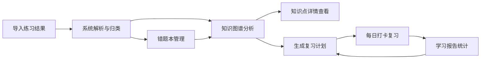

## 1. 产品概述
错题知识图谱 Web 应用，为职业考试学员打造的智能刷题复盘系统，通过知识图谱可视化薄弱知识点，辅助高效复习。
- 核心价值：系统化整理错题数据，智能识别薄弱环节，生成个性化复习路径，提升备考效率。
- 目标用户：注册会计师、法考、建造师等职业资格考试备考学员。

## 2. 核心功能

### 2.1 功能模块

1. **练习导入页面**：批量导入题目练习结果，支持多维度归类
2. **错题本页面**：错题列表管理，标记、笔记、截图功能
3. **知识图谱页面**：可视化知识点关系网络，掌握程度颜色编码
4. **知识点详情页面**：单知识点深度分析，错题、陷阱、推荐练习
5. **复习计划页面**：智能每日任务生成，打卡与延期管理
6. **学习报告页面**：多维度学习数据分析与考试提醒

### 2.2 页面详情

| 页面名称 | 模块名称 | 功能描述 |
|---------|---------|---------|
| 练习导入 | 文件上传区 | 支持拖拽上传练习结果文件（JSON/CSV格式） |
| 练习导入 | 数据预览 | 预览导入数据，校验字段完整性 |
| 练习导入 | 分类配置 | 按科目、章节、题型、错误原因进行归类配置 |
| 练习导入 | 导入进度 | 显示导入进度条与成功/失败统计 |
| 错题本 | 筛选工具栏 | 按科目、章节、掌握状态、重点标记筛选 |
| 错题本 | 错题卡片列表 | 展示题目内容、错误答案、正确答案、标签 |
| 错题本 | 操作面板 | 标记已掌握/未掌握、加入/移出重点、删除 |
| 错题本 | 订正笔记 | 富文本笔记编辑、解析截图上传与预览 |
| 知识图谱 | 筛选控制栏 | 科目切换、布局模式切换（力导向/树形）、缩放控制 |
| 知识图谱 | 图谱画布 | 节点（知识点）+ 连线（关联关系），节点颜色表示掌握程度 |
| 知识图谱 | 节点详情弹窗 | 节点名称、正确率、错题数、关联知识点 |
| 知识点详情 | 基本信息卡 | 知识点名称、所属科目章节、掌握度进度条 |
| 知识点详情 | 相关错题列表 | 该知识点下所有错题，支持快速跳转 |
| 知识点详情 | 常见陷阱 | 系统整理常见错误点与规避建议 |
| 知识点详情 | 推荐练习 | 根据错题模式推荐相似练习题 |
| 复习计划 | 日历视图 | 按日期展示每日任务量与完成状态 |
| 复习计划 | 今日任务 | 任务列表含知识点、优先级、预计耗时 |
| 复习计划 | 打卡操作 | 完成打卡、延期至明天、标记跳过 |
| 复习计划 | 任务统计 | 本周完成率、连续打卡天数 |
| 学习报告 | 正确率趋势 | 折线图展示近30天正确率变化 |
| 学习报告 | 薄弱知识点排行 | 柱状图展示反复出错TOP10知识点 |
| 学习报告 | 复习完成率 | 环形进度图展示计划完成情况 |
| 学习报告 | 考试倒计时 | 距离考试天数、考前关键提醒 |

## 3. 核心流程

用户导入练习结果后，系统自动解析并按多维度归类错题数据进入错题本供用户管理标记；知识图谱实时计算各知识点掌握程度并可视化呈现可视化图谱；系统根据错题频次智能生成每日复习任务；学习报告汇总数据形成闭环。

## 4. 用户界面设计

### 4.1 设计风格
- 主色调：深海蓝 #1e3a5f 科技蓝
- 辅助色：翠绿 #10b981（掌握良好）、橙红 #f59e0b（需加强）、深红 #ef4444（薄弱）
- 中性色：象牙白 #fafaf9 背景，深灰 #1f2937 文字
- 字体：思源宋体（标题）+ 思源黑体（正文）
- 布局：卡片式布局，顶部导航栏 + 侧边栏
- 图标：线性风格 + 柔和渐变填充

### 4.2 页面设计总览

| 页面名称 | 模块名称 | UI 元素 |
|---------|---------|---------|
| 练习导入 | 文件上传区 | 虚线边框上传框、拖拽悬停高亮、文件图标动画 |
| 练习导入 | 数据预览表 | 斑马纹表格、状态徽章、进度条 |
| 错题本 | 筛选工具栏 | 胶囊筛选标签、搜索框、下拉菜单 |
| 错题本 | 错题卡片 | 圆角卡片、标签徽章、悬停上浮动画 |
| 知识图谱 | 图谱画布 | SVG画布、节点发光效果、连线渐变着色节点、悬停放大 |
| 知识点详情 | 掌握度进度条 | 渐变色进度条、分段着色 |
| 复习计划 | 日历视图 | 日期格子、完成对勾标记、今日高亮 |
| 学习报告 | 数据图表 | 平滑折线图、渐变柱状图、环形图 |

### 4.3 响应式
- 桌面端优先设计，移动端自适应
- 知识图谱画布支持触摸缩放与拖拽
- 表格在移动端转为卡片列表展示
