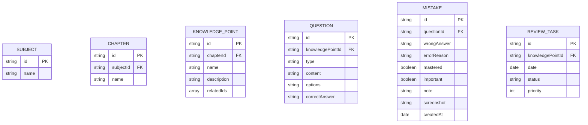

## 1. 架构设计

```mermaid
graph TD
    A["React 前端应用
    B["React Router 路由层"]
    C["状态管理层 (Zustand)"]
    D["组件层"]
    E["数据层 (Mock + LocalStorage)"]
    F["图表可视化层"]
    A --> B
    A --> C
    B --> D
    C --> D
    D --> E
    D --> F
```

## 2. 技术描述
- 前端框架：React@18 + TypeScript
- 构建工具：Vite@5
- 样式方案：TailwindCSS@3
- 状态管理：Zustand
- 路由：React Router v6
- 图表库：Recharts
- 知识图谱：D3.js (力导向图)
- 图标：Lucide React
- 数据持久化：LocalStorage + Mock 数据

## 3. 路由定义

| 路由 | 页面 | 用途 |
|------|------|------|
| /import | 练习导入 | 批量导入练习结果 |
| /mistakes | 错题本 | 错题列表与管理 |
| /graph | 知识图谱 | 知识点关系可视化 |
| /knowledge/:id | 知识点详情 | 单知识点深度分析 |
| /plan | 复习计划 | 每日任务与打卡 |
| /report | 学习报告 | 学习数据分析 |

## 4. 数据模型

### 4.1 实体关系图



### 4.2 TypeScript 类型定义

```typescript
interface Subject {
  id: string;
  name: string;
}

interface Chapter {
  id: string;
  subjectId: string;
  name: string;
}

interface KnowledgePoint {
  id: string;
  chapterId: string;
  name: string;
  description: string;
  relatedIds: string[];
}

type QuestionType = 'single' | 'multiple' | 'judge' | 'short';

interface Question {
  id: string;
  knowledgePointId: string;
  type: QuestionType;
  content: string;
  options?: string[];
  correctAnswer: string;
}

type ErrorReason = 'concept' | 'memory' | 'careless' | 'method';

interface Mistake {
  id: string;
  questionId: string;
  wrongAnswer: string;
  errorReason: ErrorReason;
  mastered: boolean;
  important: boolean;
  note: string;
  screenshot?: string;
  createdAt: string;
}

type TaskStatus = 'pending' | 'completed' | 'delayed' | 'skipped';

interface ReviewTask {
  id: string;
  knowledgePointId: string;
  date: string;
  status: TaskStatus;
  priority: number;
}

interface StudyRecord {
  date: string;
  totalCount: number;
  correctCount: number;
}
```
